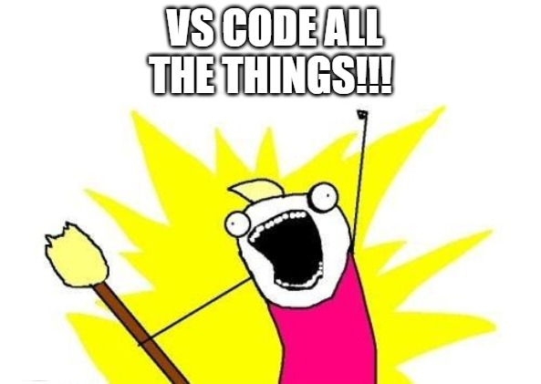

::: block
# TechBash 2019
::: 

At the Kalahari Resort in Mount Pocono, Pennsylvania.
[github with presentations and code demos](https://github.com/TechBash/techbash2019)

---

### Microservices, Legacy Code, and Testing

<ul style="text-align: left">
<li class="fragment">Modernizing .NET Framework Applications Workshop</li>
<li class="fragment">Safely Refactoring Legacy Code</li>
<li class="fragment">Unit Testing Strategies</li>
<li class="fragment">Monolith to Microservices</li>
<li class="fragment">Postman as a Testing Framework</li>
</ul>

---

### Modernizing .NET Framework Applications

[Workshop Repository](https://github.com/SeanKilleen/netcoreworkshop-mvcmovie-sample)

A day long walkthrough on how to successfully migrate an existing application to dotnet core.

I kept the steps.
Let me know if you want to do it, too.

---

### Safely Refactoring Legacy Code

 > Refactoring is a disciplined technique for restructuring an existing body of code, altering its internal structure **without changing its external behavior**.

 > Legacy code is simply code without tests. Code without tests is bad code. 
 
[Working Effectively with Legacy Code](https://www.amazon.com/Working-Effectively-Legacy-Michael-Feathers/dp/0131177052)

*by Michael Feathers*

---

### Addressing Legacy Code

 The temptation is to get rid of it and start over. But even if legacy code is bad code:
 * It works
 * It is a known quantity
 * There may be a reason the solution isn't as simple as you think it could or should be

---

### Bad code carries cost and risk

* What if it needs to be updated?
* What if it has a security issue?
* What if it is incompatible with an update that fixes a security problem?

---

#### First Steps

> Whenever I do refactoring, the first step is always the same. I need to build a solid set of tests for that section of code. 

\- *Martin Fowler*

* Automated
* Independent
* No external dependencies
* Test individual methods or smaller
* Become our safety net for fearless refactoring
* Provides a documented set of business rules

---

### Unit Testing Enables Change

The challenge of how to refactor legacy code becomes a challenge of how to unit test legacy code.

* Once it has tests, it isn't legacy code anymore
* We have a safety net
* We can fearlessly refactor
* We can just follow the catalog of business rules

---

## Unit Testing Strategies

---

### What is an automated unit test?

The term unit test has become overloaded and often are used to refer to multiple kinds of testing: 
  
<ui>
<li class="fragment"><strong>Unit tests</strong> are code developed for the purpose of testing portions of an application with known inputs and expeted outputs.</li>
<li class="fragment"><strong>Integration tests</strong> are used to test multiple modules of an application together.</li>
<li class="fragment"><strong>Functional tests</strong> validate business requirements.</li>
<li class="fragment"><strong>Technical unit tests</strong> performance, memory, scalability.</li>
</ui>

---

### Why have unit tests?

* Promote sound programming practices
* Develop higher quality software
* More productive code reviews
* Code base that is easier to refactor
* Improves longevity of your code base
* Easier to on-board developers/teams
* Find bugs when it's least expensive to fix them
* Free your QA/QE staff from repetitive tasks to work on creative testing instead

---

### Why unit tests fail Part 1

A typical plan of "more is better", or writing tests for the sake of having tests, is a big cause of failure.

* Tests were commented out each time they broke
* Tests were bound to a database or other external sources that made them brittle
* The effort required to maintain the tests exceeds the perceived value
* The developer who worked on those tests is gone

---

### Why Unit Tests Fail Part 2
* Tests weren't modified to match changes in the requirements
* We break things we don't test and test things we don't break
* The new leader doesn't want to waste money developing code that doesn't ship with the product

---

### How to succeed with unit tests

Must have a testing plan that incorporates all of these:

* Rules and best practices. Enforcement. Oversight.
* Scope, tooling, structure.
* Roles of developers, architects, testers, and designers.
* Metrics.
* Lifecycle of your tests.

---

### A little more on metrics

|Without code coverage|With Code Coverage|
|---|---|
|May only be testing happy paths|Ensure that all code paths are covered|
|Don't know how complete your tests are|Recognize unreachable code|
|   |Track progress|

---

### Monolith to Microservices

[Domain Driven Design](https://www.amazon.com/Domain-Driven-Design-Tackling-Complexity-Software/dp/0321125215/ref=sr_1_3?crid=1510EWOP8HQO1&keywords=domain+driven+design+eric+evans&qid=1575754859&s=books&sprefix=Domain+Driven%2Cstripbooks%2C487&sr=1-3)

*by Eric Evans*

---

### Key Takeaways

Monoliths aren't necessarily the problem. It's usually bad coding practices and architecture that creates the pain.

 

Microservices give you the flexibility to handle more scale at lower cost. They are not good by default.

---

### Strategies That Tend to Fail

---

### Rewrite the software with a new team

| Advantages | Disadvantages |
|---|---|
| Won't make the same mistakes as the old team | Will make all new mistakes |
| Can take a fresh look at an old problem | Lack of skills |

---

#### Reasons for failure
* Scope creep
* Lack of expertise in the business
* Relationships
* Culture 
* Morale

---

### Rewrite the software with the same team

| Advantages | Disadvantages |
|---|---|
| Won't make the same mistakes as the old team | Will make all new mistakes |
| Allows for parallel development | Features will diverge |
| | Scope |
| | Teams skills don't level up together |

---

#### Reasons for failure
* Scope creep
* Business pressure
* Morale

---

### Strive for Evolution, not Revolution

* Keep the band together
* Level up together
* Keep the business happy

---

### Goals

* Allow new systems to integrate with the old
* Allow the monolith to be the monolith for as long as it has to be
* Replace monolith functionality a little at a time
* Allow new and old systems to work together

### Implementation

1. Set up tests around system you want to change
1. Build replacemet API
1. Build anti-corruption layer

---

### Postman Delivers

1. Collections can be used to organize API calls.
2. Environments can be used to modify variables and allow API requests to be reused (one request definition can be used to hit the same API in any environment).
3. Built in methods for generating random data.
4. Ability to execute Javascript before or after test calls.
5. Ability to run a set of tests through a Node CLI tool `newman`.
6. Can be used as an integration test framework.

---

### Favorite Talk

#### Imposter Syndrome

The powerpoint wasn't put on GitHub. It was streamed, but isn't available anymore on Twitch. There should be a YouTube video "soon".

---

### Favorite Lesson

Powerpoint is obsolete. [Long live VSCode](https://marketplace.visualstudio.com/items?itemName=evilz.vscode-reveal).

---

TechBash 2020 will be be on October 13-16th next year.

Go enjoy the largest indoor waterpark in America.
